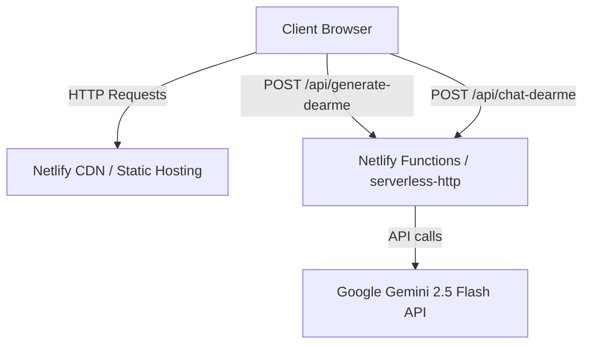
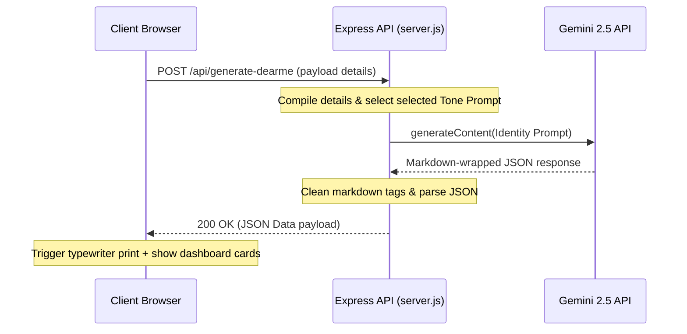
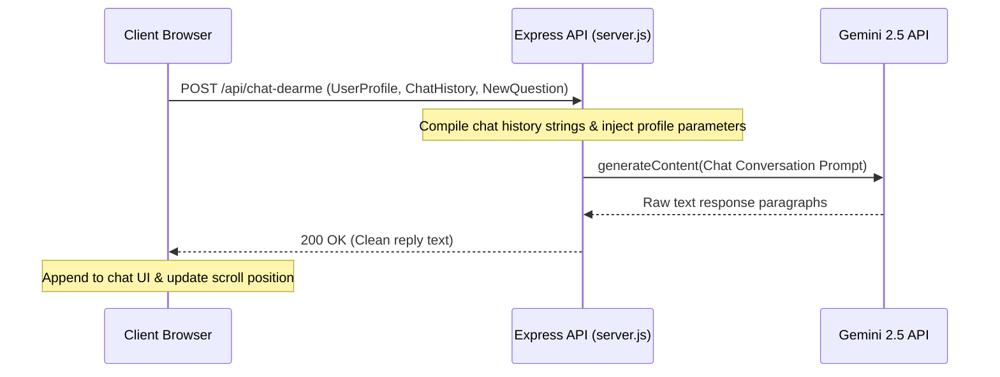

# DearMe — Technical Architecture & Implementation Documentation

This document provides a comprehensive technical breakdown of **DearMe**, detailing the architectural patterns, tech stack layers, AI prompt strategies, and serverless deployment structures that make this application work smoothly.

---

## 💻 Tech Stack Overview

DearMe is constructed as a modern, decoupled full-stack application designed to run seamlessly both in a local Node.js environment and on serverless CDN networks like Netlify.



### 1. Frontend Layer (Client)
- **HTML5 & CSS3**: Core application structure utilizing custom HSL design tokens, responsive CSS flexbox/grid layout systems, glassmorphism UI card overlays, and keyframe animations.
- **Vanilla JavaScript (ES6+)**: Handles frontend state management (user profile and conversation history arrays), client-side validation, UI state transitions, simulated typing effects, clipboard copy commands, and toast message events.

### 2. Backend Layer (Server API)
- **Node.js & Express**: Provides a robust routing layer for processing JSON payloads and serving assets.
- **serverless-http**: Wraps the Express instance so it compiles and deploys natively as a serverless Lambda-style handler on Netlify Functions without refactoring route declarations.
- **dotenv**: Manages environment injection of critical API credentials.

### 3. AI Cognitive Engine
- **Google Gemini API (`gemini-2.5-flash`)**: Used for ultra-fast, creative, and emotionally contextual responses.
- **@google/generative-ai SDK**: Official SDK utilized to initialize sessions, configure response formats, and execute prompt contents.

---

## 🔄 Core System Workflows

### 1. Profile Generation Flow
The generation sequence takes raw parameters, projects them into a structured AI context, and outputs a clean JSON schema:



### 2. Live Chat Thread Loop
The chat loop preserves the context of who the user is and how they've interacted so far:



---

## 🧠 AI Prompt Engineering Design

### 1. System Prompt for Identity Construction
To ensure Gemini returns structured data that maps perfectly to our dashboard layout, we use a rigid instruction set specifying the expected JSON keys:

```text
You are DearMe, the future successful version of the user. You speak with emotional intelligence, clarity, and deep personal understanding. Your job is to help the user see who they are becoming, what they must change, and what they should do next.

Tone selected by user: {{tone}}
User details: Name, Age, Goal, Current struggle, One-year vision.

Return only valid JSON in this exact format:
{
  "message": "A powerful 120-180 word message from the future self.",
  "futureIdentity": "A concise description of who the user is becoming.",
  "nextMoves": ["Action 1", "Action 2", "Action 3"],
  "habit": "One small daily habit they should start today.",
  "warning": "One mistake their future self warns them about.",
  "mantra": "A short memorable line they can repeat daily."
}
```

### 2. Contextual Tone Matrices
Gemini's personality dynamically adapts to the selected input parameters:
- **Motivational**: Warm, inspiring, and highly encouraging.
- **Brutally Honest**: Direct, sharp, and focused on cutting out self-justifying comfort loops.
- **Calm Mentor**: Peaceful, wise, structurally grounding, and focusing on long-term wellness.
- **CEO Mode**: Strategic, metrics-oriented, focused on resource constraints and target KPIs.

---

## ⚡ Serverless Deployment Strategy (Netlify)

To deploy an Express backend on Netlify without maintaining active servers (reducing hosting costs to zero), we implemented a serverless proxy pipeline:

1. **Local Mode vs Serverless Mode**: In [server.js](file:///C:/Users/Dell/.gemini/antigravity-ide/scratch/futureme/backend/server.js#L190-L198), we detect if the code is running in Netlify using `process.env.NETLIFY`. If `true`, the local listener `app.listen()` is bypassed, and we export the `app` instance:
   ```javascript
   if (process.env.NETLIFY !== 'true') {
     app.listen(PORT);
   }
   module.exports = app;
   ```
2. **The Serverless Bridge**: In [netlify/functions/api.js](file:///C:/Users/Dell/.gemini/antigravity-ide/scratch/futureme/netlify/functions/api.js), we use `serverless-http` to wrap the exported app, transforming Netlify Function gateway events into Node HTTP requests:
   ```javascript
   const serverless = require('serverless-http');
   const app = require('../../backend/server');
   module.exports.handler = serverless(app);
   ```
3. **Paths & Redirection**: [netlify.toml](file:///C:/Users/Dell/.gemini/antigravity-ide/scratch/futureme/netlify.toml) configures Netlify's reverse-proxy, redirecting all static page requests to `frontend` and forwarding backend API requests directly to the serverless function.
